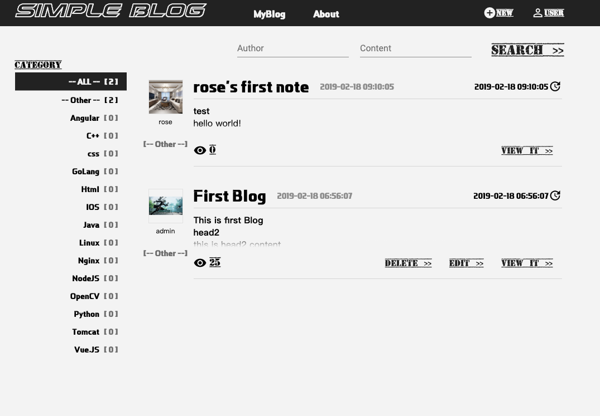
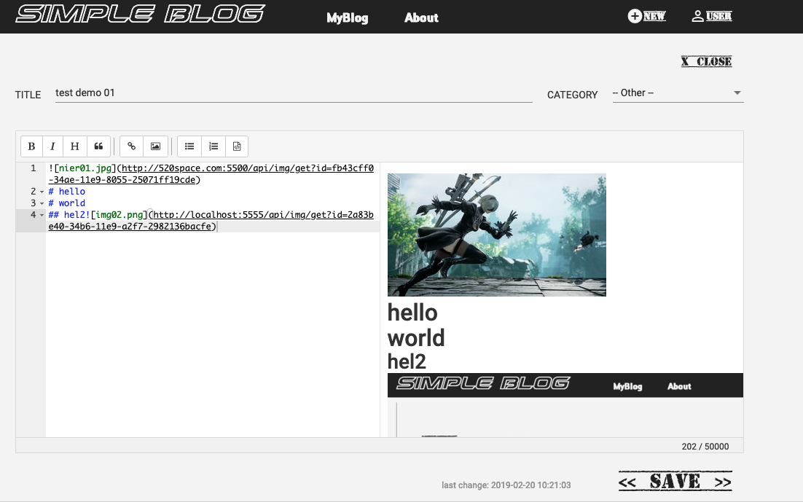
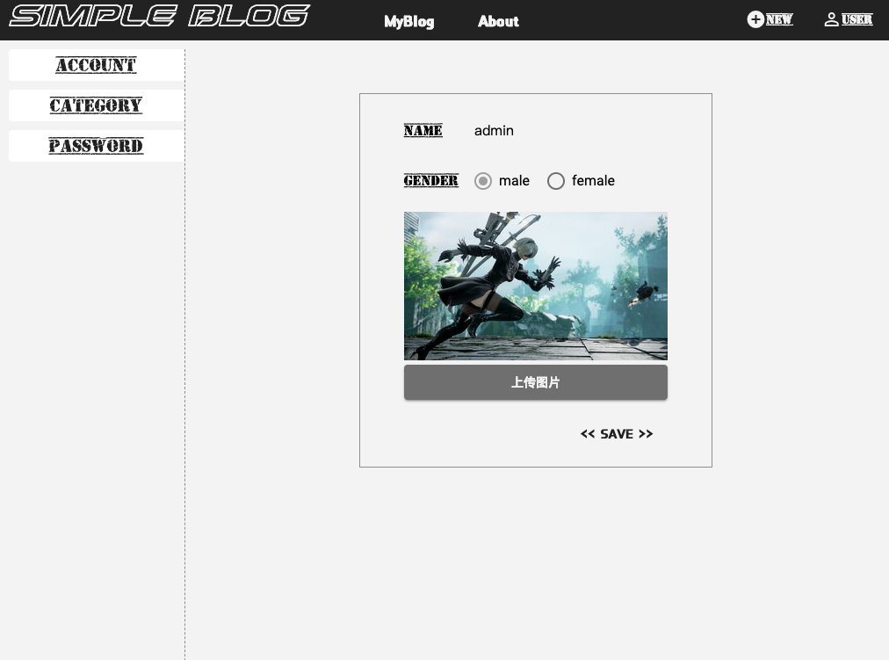
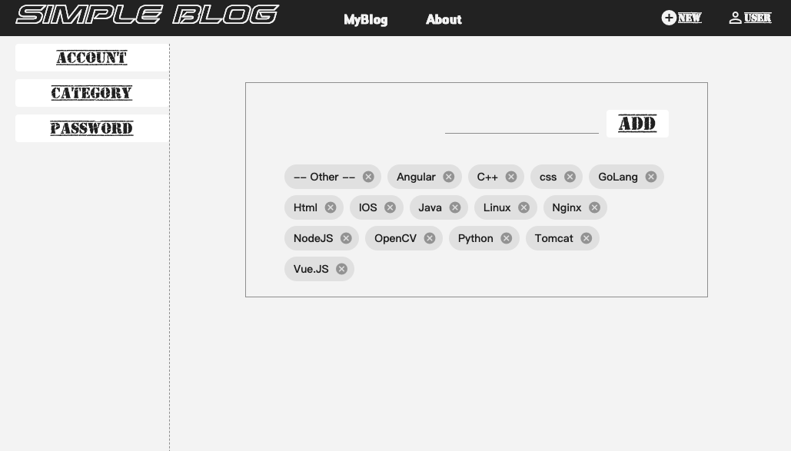

# SimpleBlog

## review
[Demo Page](http://520space.com:5500)
#### 01. main page

#### 02. edit blog page

#### 03. update account

#### 04. set category(just admin)



## db (install)

> apt-get install mariadb-server

> mysql_secure_installation

```text
...
Enter current password for root (enter for none):
Set root password? [Y/n] Y
New password:7*
...


```

> mysql -r root -p
```mysql
create user 'eno'@'%' identified by '0*';
create database note_db;
grant all on note_db.* to 'eno'@'%';
flush privileges;
```

## db (mysql)
> see './sql/mysql_db_ng_blog.sql'
